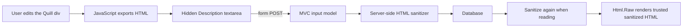

# Quill Rich-Text Editor in ASP.NET Core MVC

This guide explains how to add a Quill rich-text editor to an ASP.NET Core MVC form, save its HTML, redisplay it when editing or when validation fails, sanitize it on the server, and render it safely.

It uses the `InventoryManager` project in this repository as the concrete example.

> Verified with .NET 9, Quill 2.0.3, and HtmlSanitizer 9.2.1039. The same design works in other ASP.NET Core MVC projects, but package APIs can change between versions.

## Contents

1. [The mental model](#the-mental-model)
2. [Files used by this setup](#files-used-by-this-setup)
3. [Install Quill with npm](#install-quill-with-npm)
4. [Copy Quill into wwwroot](#copy-quill-into-wwwroot)
5. [Add the description properties](#add-the-description-properties)
6. [Add optional layout sections](#add-optional-layout-sections)
7. [Build the Razor form field](#build-the-razor-form-field)
8. [Connect Quill to the hidden field](#connect-quill-to-the-hidden-field)
9. [Load Quill on Create and Edit](#load-quill-on-create-and-edit)
10. [Install and configure server-side sanitization](#install-and-configure-server-side-sanitization)
11. [Sanitize Create and Edit submissions](#sanitize-create-and-edit-submissions)
12. [Render saved HTML safely](#render-saved-html-safely)
13. [Why ModelState.Remove is required](#why-modelstateremove-is-required)
14. [Manual ModelState experiment](#manual-modelstate-experiment)
15. [Security verification](#security-verification)
16. [Adding more formatting later](#adding-more-formatting-later)
17. [Troubleshooting](#troubleshooting)
18. [Source-control checklist](#source-control-checklist)
19. [Complete verification checklist](#complete-verification-checklist)

## The mental model

Quill edits a `<div>` in the browser. A `<div>` is not a successful form control, so the browser does not submit its contents to the server.

The form therefore contains two elements:

- A visible `<div>` that Quill turns into an editor.
- A hidden `<textarea>` whose `name="Description"` causes the browser to submit the value.

`hidden` only prevents the textarea from being displayed. It is still submitted. A `disabled` form control, by contrast, is not submitted.

JavaScript keeps those two elements synchronized:



The most important security boundary is the **server-side sanitizer**. Browser JavaScript can be disabled or bypassed, so Quill's browser behavior is not a security guarantee.

This project stores HTML because it integrates simply with MVC and Razor. Quill also has its own Delta document format, but using Delta requires a different storage and rendering design.

## Files used by this setup

The finished implementation uses these files:

```text
InventoryManager/
├── Controllers/
│   └── ProductsController.cs
├── Models/
│   ├── Product.cs
│   ├── CreateProductInputModel.cs
│   └── EditProductInputModel.cs
├── Views/
│   ├── Products/
│   │   ├── Create.cshtml
│   │   ├── Edit.cshtml
│   │   └── Details.cshtml
│   └── Shared/
│       └── _Layout.cshtml
├── wwwroot/
│   ├── js/
│   │   └── product-description-editor.js
│   └── lib/
│       └── quill/
│           ├── LICENSE
│           ├── quill.js
│           ├── quill.js.LICENSE.txt
│           └── quill.snow.css
├── package.json
├── package-lock.json
├── Program.cs
└── InventoryManager.csproj
```

## Install Quill with npm

Quill is installed through npm, so Node.js and npm must be available. Verify them in the terminal:

```powershell
node --version
npm --version
```

Open **View → Terminal** in Visual Studio and move into the MVC project directory:

```powershell
Set-Location .\InventoryManager
```

If the project does not already have a `package.json`, create one:

```powershell
npm init -y
```

The `InventoryManager` project already had `package.json` because it uses Tailwind, so that initialization step was not needed here.

Install the exact Quill version used by this project:

```powershell
npm install quill@2.0.3
```

This updates or creates:

- `package.json`, which declares the dependency.
- `package-lock.json`, which records the resolved dependency versions.
- `node_modules`, which contains the installed development copy.

The dependency appears in `package.json` as:

```json
{
  "dependencies": {
    "quill": "2.0.3"
  }
}
```

Do not commit `node_modules`. It is large and can be reconstructed with:

```powershell
npm install
```

The repository's `.gitignore` already ignores `node_modules/`.

## Copy Quill into wwwroot

ASP.NET Core serves browser assets from `wwwroot`. It does not normally expose `node_modules` directly.

Create a public Quill directory:

```powershell
New-Item -ItemType Directory -Force .\wwwroot\lib\quill
```

Copy the JavaScript, Snow theme stylesheet, and license files:

```powershell
Copy-Item .\node_modules\quill\dist\quill.js .\wwwroot\lib\quill\quill.js
Copy-Item .\node_modules\quill\dist\quill.snow.css .\wwwroot\lib\quill\quill.snow.css
Copy-Item .\node_modules\quill\dist\quill.js.LICENSE.txt .\wwwroot\lib\quill\quill.js.LICENSE.txt
Copy-Item .\node_modules\quill\LICENSE .\wwwroot\lib\quill\LICENSE
```

The copied files are intentionally committed. They are the browser assets served by the application. The copy inside `node_modules` remains ignored.

This .NET 9 project exposes files from `wwwroot` through `app.MapStaticAssets()` and `.WithStaticAssets()` in `Program.cs`. Older ASP.NET Core projects commonly use `app.UseStaticFiles()` instead.

The optional source-map files are not required for the editor to work. They can be copied when browser debugging of Quill's source is needed.

When Quill is upgraded later, repeat the copy step so `wwwroot` does not keep serving an older version.

## Add the description properties

The database entity needs a nullable description:

```csharp
public class Product
{
    public int Id { get; set; }
    public string Name { get; set; } = string.Empty;
    public string Sku { get; set; } = string.Empty;
    public string? Description { get; set; }

    // Other properties...
}
```

Both Create and Edit input models use the same maximum length:

```csharp
[StringLength(5000)]
public string? Description { get; set; }
```

The 5,000-character limit counts the stored HTML, not only the visible words. For example, `<strong>bold</strong>` is longer than the four visible characters in `bold`.

Because the real textarea is hidden, client-side validation libraries may ignore it. Server-side validation remains required even when the generated textarea has `maxlength="5000"`.

Configure the EF Core property consistently in `InventoryDbContext.OnModelCreating`:

```csharp
entity.Property(product => product.Description)
    .HasMaxLength(5000);
```

If this changes the current EF Core model, create and inspect a new migration, then update the database. Never rewrite an older migration that may already have been applied.

```powershell
dotnet ef migrations add AddProductDescription
dotnet ef database update
```

SQLite maps strings to `TEXT` and does not physically enforce `HasMaxLength`. A length-only SQLite migration can therefore have an empty `Up()` and `Down()`. The MVC validation is still useful, and providers such as SQL Server use the length when choosing a column type.

For the complete migration workflow, see [EF Core Code First Database Setup and Migrations](./ef-core-code-first-database-guide.md).

## Add optional layout sections

Only pages containing Quill need its CSS and JavaScript. The shared layout therefore exposes optional sections instead of loading Quill on every page.

In `Views/Shared/_Layout.cshtml`, render the optional Styles section inside `<head>`, after the application's main stylesheet:

```cshtml
<link rel="stylesheet" href="~/css/tailwind.css" asp-append-version="true" />
@await RenderSectionAsync("Styles", required: false)
```

Render the optional Scripts section near the end of `<body>`, after shared scripts:

```cshtml
<script src="~/lib/jquery/dist/jquery.min.js"></script>
<script src="~/js/site.js" asp-append-version="true"></script>
@await RenderSectionAsync("Scripts", required: false)
```

`required: false` means ordinary pages do not have to define these sections.

`asp-append-version="true"` adds a content-based query string to the generated URL. When a file changes, the URL changes, which prevents a browser from continuing to use an old cached copy.

## Build the Razor form field

Add this field to both `Views/Products/Create.cshtml` and `Views/Products/Edit.cshtml`:

```cshtml
<div>
    <label asp-for="Description">Description</label>

    <textarea asp-for="Description" hidden></textarea>

    <div id="description-editor" class="min-h-32 bg-white"></div>

    <span asp-validation-for="Description"></span>
</div>
```

Each part has a different responsibility:

| Element | Responsibility |
|---|---|
| `<label asp-for="Description">` | Generates a label associated with the Description property. |
| Hidden `<textarea asp-for="Description">` | Holds the value MVC submits and redisplays. |
| `<div id="description-editor">` | Becomes the visible Quill editor. |
| `<span asp-validation-for="Description">` | Displays Description validation errors. |

The hidden textarea is generated approximately as:

```html
<textarea id="Description" name="Description" hidden></textarea>
```

Its `name` is why MVC binds the submitted value to `input.Description`. Quill's visible `<div>` has no `name`, so it would not be submitted by itself.

This implementation expects one description editor on a page. If a page needs multiple editors, every editor and hidden field needs a unique ID, and the JavaScript must initialize each pair separately.

## Connect Quill to the hidden field

Create `wwwroot/js/product-description-editor.js`:

```javascript
const descriptionInput = document.querySelector('#Description');

const quill = new Quill("#description-editor", {
    theme: "snow",
    formats: ["bold", "italic", "underline"],
    modules: {
        toolbar: [
            ["bold", "italic", "underline"],
            ["clean"]
        ]
    }
});

if (descriptionInput.value) {
    quill.clipboard.dangerouslyPasteHTML(descriptionInput.value);
}

quill.on("text-change", () => {
    const descriptionHasText = quill.getText().trim().length > 0;
    descriptionInput.value = descriptionHasText
        ? quill.getSemanticHTML()
        : "";
});
```

### Initialization

```javascript
const quill = new Quill("#description-editor", { ... });
```

This turns the visible `<div>` into a Quill editor using the Snow theme.

### Formats and toolbar

```javascript
formats: ["bold", "italic", "underline"]
```

This restricts the editor to the three supported formats. The toolbar contains buttons for the same formats plus `clean`, which removes formatting.

Keeping the toolbar, Quill formats, and server sanitizer allowlist aligned makes the accepted document format easier to understand and secure.

### Loading an existing value

```javascript
if (descriptionInput.value) {
    quill.clipboard.dangerouslyPasteHTML(descriptionInput.value);
}
```

The hidden field can already contain HTML when:

- An existing product is being edited.
- The server returns an invalid form.

`dangerouslyPasteHTML` tells Quill to interpret that value as HTML and put it into the editor. Its name is an intentional warning: the value must not be trusted merely because Quill processed it. Server-side sanitization is still required.

### Synchronizing edits

```javascript
quill.on("text-change", () => {
    descriptionInput.value = quill.getSemanticHTML();
});
```

Every editor change updates the hidden textarea. When the form is submitted, the browser sends that textarea value.

The full implementation first checks `quill.getText().trim()`. Quill can represent an empty editor with HTML such as `<p></p>`. Saving an empty string instead lets the server treat a visually empty description as `null`.

Because this script assumes both elements exist, load it only on pages containing `#Description` and `#description-editor`. If it is loaded globally, add null checks before initializing Quill.

## Load Quill on Create and Edit

At the bottom of both Create and Edit views, add:

```cshtml
@section Styles
{
    <link rel="stylesheet"
          href="~/lib/quill/quill.snow.css"
          asp-append-version="true" />
}

@section Scripts
{
    <partial name="_ValidationScriptsPartial" />

    <script src="~/lib/quill/quill.js"
            asp-append-version="true"></script>
    <script src="~/js/product-description-editor.js"
            asp-append-version="true"></script>
}
```

The ordering matters:

1. The layout places Quill's stylesheet in `<head>`.
2. The Quill library defines the global `Quill` constructor.
3. `product-description-editor.js` uses that constructor.

Loading the custom script before `quill.js` causes `Quill is not defined`.

## Install and configure server-side sanitization

Rich text is HTML. If the application renders user-supplied HTML without sanitizing it, an attacker can store markup that executes JavaScript in another user's browser. This is stored cross-site scripting, usually shortened to stored XSS.

### Install HtmlSanitizer

Using the Visual Studio GUI:

1. Right-click the `InventoryManager` project.
2. Select **Manage NuGet Packages**.
3. Open **Browse**.
4. Search for `HtmlSanitizer`.
5. Install stable version `9.2.1039`.

Or run this from the project directory:

```powershell
dotnet add package HtmlSanitizer --version 9.2.1039
```

The project file then contains:

```xml
<PackageReference Include="HtmlSanitizer" Version="9.2.1039" />
```

### Configure a strict allowlist

In `Program.cs`, import the package namespace:

```csharp
using Ganss.Xss;
```

Register one configured sanitizer:

```csharp
builder.Services.AddSingleton<IHtmlSanitizer>(_ =>
    new HtmlSanitizer(new HtmlSanitizerOptions
    {
        AllowedTags = new HashSet<string>(StringComparer.OrdinalIgnoreCase)
        {
            "p", "br", "strong", "em", "u"
        }
    }));
```

The current allowlist means:

| HTML | Purpose |
|---|---|
| `<p>` | Paragraphs produced by Quill. |
| `<br>` | Line breaks. |
| `<strong>` | Bold text. |
| `<em>` | Italic text. |
| `<u>` | Underlined text. |

No links, images, scripts, inline event handlers, CSS, or arbitrary attributes are needed for the configured editor formats.

The sanitizer is registered as a singleton because this configured instance is safe to reuse and the application does not mutate its configuration after startup.

## Sanitize Create and Edit submissions

### Inject the sanitizer

Add it to `ProductsController`:

```csharp
using Ganss.Xss;

public class ProductsController : Controller
{
    private readonly InventoryDbContext _context;
    private readonly IHtmlSanitizer _htmlSanitizer;

    public ProductsController(
        InventoryDbContext dbContext,
        IHtmlSanitizer htmlSanitizer)
    {
        _context = dbContext;
        _htmlSanitizer = htmlSanitizer;
    }
}
```

ASP.NET Core's dependency-injection container creates the controller and supplies the configured sanitizer automatically.

### Add one helper method

```csharp
private string? SanitizeDescription(string? description)
{
    if (string.IsNullOrWhiteSpace(description))
    {
        return null;
    }

    var sanitizedDescription =
        _htmlSanitizer.Sanitize(description.Trim()).Trim();

    return string.IsNullOrWhiteSpace(sanitizedDescription)
        ? null
        : sanitizedDescription;
}
```

This method:

1. Converts null, empty, or whitespace-only input to `null`.
2. Removes HTML outside the allowlist.
3. Trims the resulting HTML string.
4. Returns `null` if nothing meaningful remains.

### POST Create

At the beginning of the POST Create action:

```csharp
input.Description = SanitizeDescription(input.Description);

ModelState.Remove(nameof(input.Description));

if (input.Description?.Length > 5000)
{
    ModelState.AddModelError(
        nameof(input.Description),
        "Description must be 5000 characters or fewer.");
}
```

Continue with the action's other validation. If the model is invalid, reload any display-only data such as category choices and return the same input model:

```csharp
if (!ModelState.IsValid)
{
    input.Categories = _context.Categories
        .OrderBy(category => category.Name)
        .ToList();

    return View(input);
}
```

When validation succeeds, assign the already-sanitized description:

```csharp
var product = new Product
{
    Name = input.Name!.Trim(),
    Sku = input.Sku!.Trim(),
    Description = input.Description,

    // Other properties...
};
```

### POST Edit

First find the product. After confirming it exists, apply the same description sequence:

```csharp
var product = _context.Products
    .SingleOrDefault(product => product.Id == input.Id);

if (product == null)
{
    return NotFound();
}

input.Description = SanitizeDescription(input.Description);

ModelState.Remove(nameof(input.Description));

if (input.Description?.Length > 5000)
{
    ModelState.AddModelError(
        nameof(input.Description),
        "Description must be 5000 characters or fewer.");
}
```

After all validation succeeds:

```csharp
product.Description = input.Description;
```

Sanitize before writing for both Create and Edit. Protecting only Create would allow an unsafe description to enter through Edit.

## Render saved HTML safely

Razor normally HTML-encodes values:

```cshtml
@Model.Description
```

If the value is `<strong>bold</strong>`, normal Razor output displays those characters as text instead of creating a bold element. Encoding is Razor's safe default.

To render formatting, the Details view uses:

```cshtml
@if (string.IsNullOrWhiteSpace(Model.Description))
{
    <p>No description was provided.</p>
}
else
{
    <div>
        @Html.Raw(Model.Description)
    </div>
}
```

`Html.Raw` writes the string without Razor encoding it. The browser can then interpret `<strong>`, `<em>`, and the other allowed tags.

This is safe only when the value has passed through the server-side sanitizer. Do not use `Html.Raw` for arbitrary request data or unsanitized database content.

### Sanitize stored values when reading

Sanitizing on write protects new and edited rows. Sanitizing again before rendering also protects against older unsafe data, manual database changes, or a past bug.

For a read-only Details query:

```csharp
var product = _context.Products
    .AsNoTracking()
    .Include(product => product.Category)
    .SingleOrDefault(product => product.Id == id);

if (product == null)
{
    return NotFound();
}

product.Description = SanitizeDescription(product.Description);

return View(product);
```

For GET Edit, sanitize while mapping the entity to the input model:

```csharp
var model = new EditProductInputModel
{
    Id = product.Id,
    Description = SanitizeDescription(product.Description),

    // Other properties...
};
```

Sanitizing on both write and read is defense in depth. It does not replace fixing known unsafe rows in the database, but it prevents them from executing while they are being cleaned.

## Why ModelState.Remove is required

When MVC binds a submitted form, it keeps field information in two places:

1. The input-model property, such as `input.Description`.
2. `ModelState`, including the original submitted or **attempted value**.

This design is useful. Suppose a user enters `abc` into an `int` field. MVC cannot store `abc` in the integer property, but ModelState can preserve the exact text so the form can redisplay it with an error.

Razor's Input Tag Helper follows this precedence when it renders a field after a POST:

```text
ModelState attempted value
        ↓ if no entry exists
Model property value
```

The sanitizer changes only the input-model property:

```csharp
input.Description = SanitizeDescription(input.Description);
```

It does not update ModelState's older attempted value. Therefore this is possible:

```text
input.Description                         sanitized HTML
ModelState["Description"].AttemptedValue  original HTML
```

Without removing the old entry, `<textarea asp-for="Description">` prefers the original value from ModelState. The JavaScript then reads that textarea and passes the value to Quill.

Remove only the Description entry:

```csharp
ModelState.Remove(nameof(input.Description));
```

Now the Input Tag Helper has no attempted Description value, so it falls back to the sanitized `input.Description` property.

Do not use `ModelState.Clear()` here. That would also discard the user's attempted values and errors for every other field.

Removing the Description entry also removes its original validation state, including the `[StringLength(5000)]` result produced during model binding. That is why the action checks the sanitized length again and adds a fresh error when necessary.

## Manual ModelState experiment

Use this experiment only in local development. Its markers are harmless: they demonstrate which copy Razor selected without executing JavaScript.

### 1. Add breakpoints

In POST Create, add breakpoints on:

```csharp
input.Description = SanitizeDescription(input.Description);
```

and:

```csharp
ModelState.Remove(nameof(input.Description));
```

### 2. Submit a marked value

Open Create Product, fill the required fields, and choose a valid category. Then run this in the browser developer console:

```javascript
const raw =
    '<p data-origin="RAW-MODELSTATE">Safe <strong>bold</strong><mark>marker</mark></p>';

document.querySelector("#Description").value = raw;
document.querySelector("#Name").value = "";
document.querySelector("form").submit();
```

Emptying Name causes server validation to return the form. Calling `form.submit()` bypasses browser validation but still submits the form fields, including the anti-forgery token.

The test markup contains:

- `<strong>`, which the application allows.
- `<mark>`, which normally highlights text but is not in this application's allowlist.
- `data-origin`, a custom `data-*` attribute used only as a recognizable marker.

### 3. Compare the two copies

After the sanitization line has executed, inspect:

```csharp
input.Description
```

It should resemble:

```html
<p>Safe <strong>bold</strong>marker</p>
```

Then inspect:

```csharp
ModelState["Description"]?.AttemptedValue
```

It should still contain:

```html
<p data-origin="RAW-MODELSTATE">Safe <strong>bold</strong><mark>marker</mark></p>
```

This proves that assigning a new property value does not rewrite ModelState.

Step over `ModelState.Remove(...)`. This should now be `null`:

```csharp
ModelState["Description"]
```

Continue running. On the returned page, inspect the hidden field:

```javascript
document.querySelector("#Description").value
```

It should contain only the sanitized version.

### 4. Temporarily reproduce the bug

Comment out only this line:

```csharp
// ModelState.Remove(nameof(input.Description));
```

Repeat the same submission. At `return View(input)`, `input.Description` is sanitized, but the ModelState attempted value is still original.

On the returned page:

```javascript
document.querySelector("#Description").value
```

The hidden textarea should again contain `data-origin="RAW-MODELSTATE"` and `<mark>`. That proves `asp-for` selected ModelState instead of the modified model property.

Quill may remove unsupported markup from the visible editor, so the editor's appearance is not the decisive observation. Inspect the hidden textarea value.

Restore the line immediately after the experiment:

```csharp
ModelState.Remove(nameof(input.Description));
```

Do not commit the temporarily broken version.

## Security verification

Perform all security experiments against a local development database, never against production data.

### Normal formatting test

1. Create a product.
2. Enter plain, bold, italic, and underlined description text.
3. Submit the form.
4. Open Details and confirm the allowed formatting appears.
5. Open Edit and confirm the saved formatting loads back into Quill.

### Invalid-form test

1. Fill the form and enter formatted description text.
2. Cause a server-side error, such as using an existing SKU.
3. Submit.
4. Confirm the error appears.
5. Confirm the sanitized description is restored in Quill.
6. Confirm category choices and other required display data are also restored.

### Sanitizer test

In the browser console, replace the hidden description with deliberately unsafe test HTML:

```javascript
document.querySelector("#Description").value = `
    <p onclick="alert('XSS test')">
        Safe <strong>bold</strong>
    </p>
    <script>alert('XSS test')</script>
    
`;
```

Submit the form locally and verify:

- No alert executes on Details or Edit.
- The `<script>` element is removed.
- The `` element is removed.
- The `onclick` attribute is removed.
- The `<p>` and `<strong>` formatting remains.
- If you inspect the database, the newly stored value is already sanitized.

Also repeat this test while causing another validation error. That checks the `ModelState.Remove` path before anything is saved.

These tests verify the current path and allowlist. They do not prove that the entire website is secure. Keep ASP.NET Core, Quill, and HtmlSanitizer patched and include security testing in the normal development process.

## Adding more formatting later

The current editor supports only:

- Bold
- Italic
- Underline
- Paragraphs and line breaks
- Removing formatting

When adding a format, review all three layers together:

1. Add the control to Quill's `toolbar` configuration.
2. Add the format name to Quill's `formats` array.
3. Add only the required safe HTML tags or attributes to the server sanitizer.

Do not merely enable every HTML tag and attribute to make a new feature work.

Links need special care because allowing `<a>` is not enough. The sanitizer must also allow the necessary `href` attribute and restrict dangerous URI schemes. Images, embedded video, custom CSS, and pasted content require their own threat review.

After changing the accepted format:

1. Test Create.
2. Test Edit.
3. Test a validation failure.
4. Test Details rendering.
5. Repeat the sanitizer test.
6. Check existing stored descriptions.

## Troubleshooting

### `Quill is not defined`

The custom editor script loaded before `quill.js`, or the Quill asset returned 404.

Check this order:

```cshtml
<script src="~/lib/quill/quill.js"></script>
<script src="~/js/product-description-editor.js"></script>
```

### The editor has no toolbar styling

Confirm the Snow theme stylesheet exists in `wwwroot/lib/quill` and that the view defines its Styles section:

```cshtml
<link rel="stylesheet" href="~/lib/quill/quill.snow.css" />
```

Also confirm `_Layout.cshtml` renders the Styles section inside `<head>`.

### The editor works, but Description is null after submitting

Check that:

- The hidden textarea uses `asp-for="Description"`.
- Its generated ID is `Description`.
- The JavaScript finds `#Description`.
- The `text-change` handler updates `descriptionInput.value`.
- The form actually contains the hidden textarea.

Remember that the Quill `<div>` is not submitted by itself.

### Existing HTML does not load into Edit

Check that:

- GET Edit assigns `Description` to the input model.
- The hidden textarea contains that value.
- `quill.js` loads before the shared editor script.
- `dangerouslyPasteHTML(descriptionInput.value)` runs.

### Original unsafe HTML returns after a validation error

Sanitizing `input.Description` is not sufficient when ModelState still contains the submitted attempted value.

Confirm that the POST action calls:

```csharp
ModelState.Remove(nameof(input.Description));
```

after sanitizing and before returning the view.

### The description looks short but fails the length limit

The limit counts HTML tags and attributes as well as visible text. Inspect:

```javascript
document.querySelector("#Description").value.length
```

This displays the length actually submitted.

### An empty editor saves `<p></p>`

Use `quill.getText().trim()` to detect whether the editor contains visible text. Set the hidden input to an empty string when it does not.

### Quill assets work after npm install but not after deployment

Files in `node_modules` are not the deployed browser assets in this setup. Confirm the required Quill files were copied and committed under `wwwroot/lib/quill`.

### A Quill upgrade does not appear in the browser

Update the files copied into `wwwroot`, not only the npm dependency. Keep `asp-append-version="true"` so changed files receive new browser URLs.

### SQLite generated an empty length migration

SQLite stores the description as `TEXT` and does not encode the configured maximum length in its physical column type. An empty schema migration can therefore be correct when only `HasMaxLength` changed. Keep the migration and snapshot as the record of the EF Core model change.

## Source-control checklist

Commit:

- `InventoryManager/package.json`
- `InventoryManager/package-lock.json`
- `InventoryManager/InventoryManager.csproj`
- Quill browser assets and license files under `InventoryManager/wwwroot/lib/quill`
- `InventoryManager/wwwroot/js/product-description-editor.js`
- Changed entity, input-model, DbContext, controller, and Razor files
- Any new EF Core migration and model snapshot changes
- This guide

Do not commit:

- `node_modules`
- `bin`
- `obj`
- The local SQLite database files
- Temporary code that disables `ModelState.Remove` or sanitization

## Complete verification checklist

- [ ] Quill is recorded in `package.json` and `package-lock.json`.
- [ ] Quill's browser assets are under `wwwroot/lib/quill`.
- [ ] License files are preserved with the copied third-party assets.
- [ ] The layout has optional Styles and Scripts sections.
- [ ] Create and Edit contain the hidden `Description` textarea.
- [ ] Create and Edit contain the visible Quill editor `<div>`.
- [ ] Quill's CSS loads in the Styles section.
- [ ] `quill.js` loads before the custom editor script.
- [ ] The hidden textarea updates whenever editor content changes.
- [ ] Existing HTML loads into Quill on Edit.
- [ ] Visually empty content becomes an empty string or `null`.
- [ ] HtmlSanitizer is installed and registered with a strict allowlist.
- [ ] POST Create sanitizes before validation is completed and before saving.
- [ ] POST Edit sanitizes before validation is completed and before saving.
- [ ] Both actions remove only the Description ModelState entry.
- [ ] Both actions validate the sanitized description length again.
- [ ] Invalid forms reload required display data such as categories.
- [ ] Read actions sanitize legacy database values before raw rendering.
- [ ] `Html.Raw` is used only with sanitized HTML.
- [ ] Normal formatting, invalid forms, and unsafe input have been tested.
- [ ] The application builds without errors or warnings.

## References

- [Quill documentation](https://quilljs.com/docs/quickstart)
- [Quill configuration](https://quilljs.com/docs/configuration)
- [Quill formats](https://quilljs.com/docs/formats)
- [HtmlSanitizer package](https://www.nuget.org/packages/HtmlSanitizer/9.2.1039)
- [HtmlSanitizer repository](https://github.com/mganss/HtmlSanitizer)
- [Microsoft: Prevent cross-site scripting in ASP.NET Core](https://learn.microsoft.com/en-us/aspnet/core/security/cross-site-scripting)
