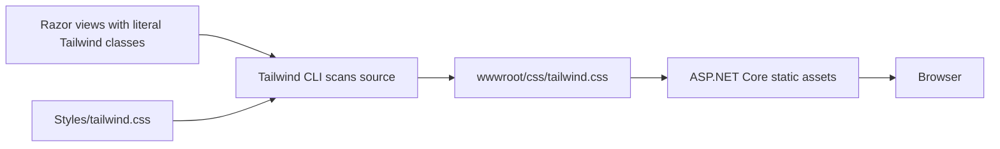

# Replace Bootstrap with Tailwind CSS in ASP.NET Core MVC

This guide explains how to set up Tailwind CSS v4 with npm in an ASP.NET Core MVC project and replace the default Bootstrap integration without breaking MVC form validation.

It uses the `InventoryManager` project in this repository as the concrete example.

> Verified with .NET 9, Tailwind CSS 4.3.3, `@tailwindcss/cli` 4.3.3, npm 11, and Node.js 24. Use a currently supported Node.js LTS release when reproducing the setup elsewhere.

## Contents

1. [The finished data flow](#the-finished-data-flow)
2. [What replacing Bootstrap means](#what-replacing-bootstrap-means)
3. [Prerequisites](#prerequisites)
4. [Initialize npm](#initialize-npm)
5. [Install Tailwind CSS v4](#install-tailwind-css-v4)
6. [Create the Tailwind input stylesheet](#create-the-tailwind-input-stylesheet)
7. [Add the npm scripts](#add-the-npm-scripts)
8. [Generate the first CSS file](#generate-the-first-css-file)
9. [Replace Bootstrap in the shared layout](#replace-bootstrap-in-the-shared-layout)
10. [Rewrite Bootstrap markup](#rewrite-bootstrap-markup)
11. [Development workflow in Visual Studio](#development-workflow-in-visual-studio)
12. [How Tailwind detects Razor classes](#how-tailwind-detects-razor-classes)
13. [Page-specific and third-party CSS](#page-specific-and-third-party-css)
14. [What can be deleted](#what-can-be-deleted)
15. [Source control](#source-control)
16. [Publishing and deployment](#publishing-and-deployment)
17. [Manual verification](#manual-verification)
18. [Troubleshooting](#troubleshooting)
19. [Current InventoryManager setup](#current-inventorymanager-setup)
20. [Complete checklist](#complete-checklist)

## The finished data flow

Tailwind is build tooling. It scans source files for utility-class names and generates an ordinary CSS file that ASP.NET Core serves to the browser.



The browser does not run Tailwind and the production web server does not need Node.js when the generated CSS file is included in the published application.

There are two different CSS files in this setup:

| File | Purpose |
|---|---|
| `Styles/tailwind.css` | Small source file maintained by the developer. |
| `wwwroot/css/tailwind.css` | Generated browser file produced by the Tailwind CLI. |

Never manually edit the generated file. The next Tailwind build would overwrite those edits.

## What replacing Bootstrap means

The default MVC template normally loads Bootstrap through `_Layout.cshtml`:

```cshtml
<link rel="stylesheet" href="~/lib/bootstrap/dist/css/bootstrap.min.css" />
```

and:

```cshtml
<script src="~/lib/bootstrap/dist/js/bootstrap.bundle.min.js"></script>
```

Replacing Bootstrap has three separate parts:

1. Stop loading Bootstrap's CSS.
2. Stop loading Bootstrap's JavaScript if no Bootstrap JavaScript components remain.
3. Rewrite Bootstrap-specific HTML classes and behavior with Tailwind utilities.

Removing only the Bootstrap references disables Bootstrap, but it does not translate classes such as these:

```html
class="navbar navbar-expand-sm"
class="btn btn-primary"
class="form-control"
```

Once Bootstrap is no longer loaded, those class names normally have no useful styling. The markup must be deliberately rewritten.

There is no special “Bootstrap meta tag.” Keep this normal viewport element:

```html
<meta name="viewport" content="width=device-width, initial-scale=1.0" />
```

It is standard browser configuration and remains useful even when the current UI is desktop-first.

## Prerequisites

You need:

- An ASP.NET Core MVC project.
- Node.js and npm installed.
- A terminal whose current directory is the MVC project directory.

Verify Node.js and npm:

```powershell
node --version
npm --version
```

In Visual Studio, open **View → Terminal**. From this repository's root, enter the project directory:

```powershell
Set-Location .\InventoryManager
```

All commands in the setup sections assume the terminal is now inside `InventoryManager`.

## Initialize npm

First check whether `package.json` already exists in the project directory.

If it does not exist, create it:

```powershell
npm init -y
```

Do not run `npm init` again when the project already has a `package.json`. The `InventoryManager` project already has one.

For an existing clone that already contains both `package.json` and `package-lock.json`, restore exactly the recorded dependencies with:

```powershell
npm ci
```

Use `npm install` when deliberately adding or changing a dependency. Use `npm ci` when reproducing the dependency versions recorded in source control.

## Install Tailwind CSS v4

Install Tailwind and its separate v4 command-line package as development dependencies:

```powershell
npm install --save-dev tailwindcss@4.3.3 @tailwindcss/cli@4.3.3
```

The packages have different roles:

- `tailwindcss` contains the Tailwind framework and CSS engine.
- `@tailwindcss/cli` supplies the `tailwindcss` terminal command used by the npm scripts.

They are `devDependencies` because the CLI is used while building the application, not by C# while handling web requests.

The relevant part of `package.json` should resemble:

```json
{
  "devDependencies": {
    "@tailwindcss/cli": "^4.3.3",
    "tailwindcss": "^4.3.3"
  }
}
```

npm also updates `package-lock.json` and creates `node_modules`.

- Commit `package.json`.
- Commit `package-lock.json`.
- Do not commit `node_modules`.

This is an npm setup. It does not require a Tailwind NuGet package or a change to the `.csproj` file.

## Create the Tailwind input stylesheet

Create this directory and file:

```text
InventoryManager/
└── Styles/
    └── tailwind.css
```

Using the Visual Studio GUI:

1. Right-click the `InventoryManager` project in Solution Explorer.
2. Select **Add → New Folder**.
3. Name it `Styles`.
4. Right-click `Styles`.
5. Select **Add → New Item**.
6. Add a stylesheet named `tailwind.css`.

Put this in the file:

```css
@import "tailwindcss" source("../");

@source not "../wwwroot/lib";
```

### Import Tailwind

```css
@import "tailwindcss" source("../");
```

This imports Tailwind and sets the automatic source-detection base to the project directory. The input stylesheet is inside `Styles`, so `../` points one level upward to `InventoryManager`.

Tailwind can then detect literal utility classes in project files such as:

```cshtml
<h1 class="text-3xl font-bold text-blue-600">Products</h1>
```

### Exclude third-party browser libraries

```css
@source not "../wwwroot/lib";
```

The `wwwroot/lib` directory contains third-party files such as Bootstrap, jQuery, validation libraries, and Quill. They are not application templates and do not need to be scanned for Tailwind class names.

Excluding them avoids generating unnecessary utilities from class-like text found inside vendor files and keeps scanning faster and more predictable.

### Tailwind v4 versus older tutorials

This basic Tailwind v4 setup does not need:

- `tailwind.config.js`
- `npx tailwindcss init`
- `@tailwind base`
- `@tailwind components`
- `@tailwind utilities`

Those instructions commonly belong to Tailwind v3 tutorials. Do not mix v3 and v4 setup steps without understanding the version difference.

## Add the npm scripts

Add these commands to the `scripts` object in `package.json`:

```json
{
  "scripts": {
    "css:watch": "tailwindcss -i ./Styles/tailwind.css -o ./wwwroot/css/tailwind.css --watch",
    "css:build": "tailwindcss -i ./Styles/tailwind.css -o ./wwwroot/css/tailwind.css --minify"
  }
}
```

The options mean:

| Option | Meaning |
|---|---|
| `-i ./Styles/tailwind.css` | Read the developer-maintained input stylesheet. |
| `-o ./wwwroot/css/tailwind.css` | Write the generated CSS where ASP.NET Core can serve it. |
| `--watch` | Keep running and rebuild after source changes. |
| `--minify` | Produce a smaller deployment/commit output. |

Using npm scripts means the project records the exact command. Developers run the same command without installing a global Tailwind executable.

## Generate the first CSS file

Run the production-style build once:

```powershell
npm run css:build
```

This should generate:

```text
wwwroot/css/tailwind.css
```

If your terminal is at the repository root instead of inside the project, use:

```powershell
npm --prefix .\InventoryManager run css:build
```

The generated file should begin with a Tailwind version comment. Its contents will depend on the utility classes Tailwind detects in the project.

ASP.NET Core serves files from `wwwroot`. In this .NET 9 project, `Program.cs` uses:

```csharp
app.MapStaticAssets();
```

and:

```csharp
app.MapControllerRoute(
    name: "default",
    pattern: "{controller=Home}/{action=Index}/{id?}")
    .WithStaticAssets();
```

Older ASP.NET Core projects commonly use `app.UseStaticFiles()` instead.

## Replace Bootstrap in the shared layout

Open `Views/Shared/_Layout.cshtml`.

### Replace the Bootstrap stylesheet

Remove:

```cshtml
<link rel="stylesheet" href="~/lib/bootstrap/dist/css/bootstrap.min.css" />
```

Add:

```cshtml
<link rel="stylesheet"
      href="~/css/tailwind.css"
      asp-append-version="true" />
```

`asp-append-version="true"` adds a content-based version query to the generated URL. When the CSS file changes, its URL changes, which prevents the browser from continuing to use a stale cached version.

### Remove Bootstrap JavaScript

Remove this when no Bootstrap JavaScript components remain:

```cshtml
<script src="~/lib/bootstrap/dist/js/bootstrap.bundle.min.js"></script>
```

Bootstrap components such as its collapsible navbar, modal, dropdown, tooltip, and carousel depend on that script. Removing it means those Bootstrap behaviors must also be removed or replaced.

The current desktop-only `InventoryManager` navigation uses a straightforward Tailwind flex layout, so it does not need Bootstrap's collapsing-navbar script.

### Keep jQuery when MVC validation uses it

This is not Bootstrap:

```cshtml
<script src="~/lib/jquery/dist/jquery.min.js"></script>
```

The current Create and Edit pages render `_ValidationScriptsPartial`, which loads:

```cshtml
<script src="~/lib/jquery-validation/dist/jquery.validate.min.js"></script>
<script src="~/lib/jquery-validation-unobtrusive/dist/jquery.validate.unobtrusive.min.js"></script>
```

Those libraries provide client-side behavior for the `data-val-*` attributes generated from DataAnnotations. Keep them if you want client-side MVC validation.

Removing jQuery validation would not disable server-side `ModelState` validation, but errors would appear only after the form is submitted to the server.

### Decide separately about application CSS

The following files are not automatically “Bootstrap”:

```cshtml
<link rel="stylesheet" href="~/css/site.css" asp-append-version="true" />
<link rel="stylesheet" href="~/InventoryManager.styles.css" asp-append-version="true" />
```

- `site.css` is application-owned CSS from the MVC template.
- `InventoryManager.styles.css` is generated from Razor CSS-isolation files such as `_Layout.cshtml.css`.

They can coexist with Tailwind. Keep them if they contain useful custom rules. Remove their layout references only after reviewing the rules and deciding Tailwind replaces them.

The current `InventoryManager` layout stopped loading both because its old template rules were no longer needed.

### Resulting head

The current layout contains:

```cshtml
<head>
    <meta charset="utf-8" />
    <meta name="viewport" content="width=device-width, initial-scale=1.0" />
    <title>@ViewData["Title"] - InventoryManager</title>
    <script type="importmap"></script>
    <link rel="stylesheet" href="~/css/tailwind.css" asp-append-version="true" />
    @await RenderSectionAsync("Styles", required: false)
</head>
```

## Rewrite Bootstrap markup

Removing Bootstrap's files does not convert the existing pages. Rewrite the shared layout and views a section at a time.

There is no guaranteed one-to-one conversion because Bootstrap provides named components while Tailwind provides small styling utilities. Typical starting points are:

| Bootstrap intent | Tailwind starting point |
|---|---|
| `.container` | `mx-auto w-full max-w-6xl px-6` |
| `.navbar-nav` | `flex items-center gap-6` |
| `.navbar-brand` | `text-xl font-semibold` |
| `.btn.btn-primary` | `rounded-md bg-blue-600 px-4 py-2 text-white` |
| `.form-control` | `w-full rounded-md border border-slate-300 px-3 py-2` |
| `.text-danger` | `text-red-600` |
| `.text-muted` | `text-slate-500` |
| `.display-4` | `text-4xl font-bold` |

These are examples, not automatic replacements. Add focus, hover, spacing, and accessibility behavior appropriate to each control.

For example, the original template body:

```cshtml
<body>
    <div class="container">
        <main role="main" class="pb-3">
            @RenderBody()
        </main>
    </div>
</body>
```

became:

```cshtml
<body class="flex min-h-screen flex-col bg-slate-50 text-slate-900">
    <div class="mx-auto w-full max-w-6xl flex-1 px-6 py-8">
        <main role="main">
            @RenderBody()
        </main>
    </div>
</body>
```

Tailwind includes a base reset called Preflight. After switching, raw headings, lists, buttons, and form controls can look plainer than before. That is expected: apply utilities to create the intended appearance.

Be cautious while converting. Some old Bootstrap class names also happen to be valid Tailwind utilities, including names such as `container`, `hidden`, `table`, `mb-3`, and `bg-white`. A partly converted page can therefore look inconsistently styled instead of completely unstyled.

## Development workflow in Visual Studio

Use two independently running processes:

1. Visual Studio runs the ASP.NET Core application.
2. Tailwind watches Razor and other source files and regenerates CSS.

### Start watch mode

Open **View → Terminal**, make sure the prompt is inside `InventoryManager`, and run:

```powershell
npm run css:watch
```

Leave that terminal running while editing `.cshtml`, JavaScript, or other files containing Tailwind class names. The watcher rebuilds when saved source files change.

Run or debug the MVC application normally in Visual Studio. Refresh the browser to see the regenerated CSS.

Stop the watcher with `Ctrl+C`.

### Before committing or publishing

Run:

```powershell
npm run css:build
```

This creates a minified output. Then inspect Git Changes and confirm the intended source files and `wwwroot/css/tailwind.css` changed.

The .NET build does not automatically run the npm script in the current project. A successful `dotnet build` does not prove the generated Tailwind file is current.

### Seeing npm and generated files in Visual Studio

If Solution Explorer does not show them:

- Enable **Show All Files**, or
- Use **Switch Views → Folder View**.

Folder View is useful for seeing `package.json`, `package-lock.json`, `Styles`, `node_modules`, and generated browser assets exactly where they exist on disk.

## How Tailwind detects Razor classes

Tailwind scans source text. It does not execute Razor or understand every possible runtime string construction.

Literal classes work:

```cshtml
<p class="text-sm font-medium text-red-600">Invalid product</p>
```

Complete literal alternatives also work:

```cshtml
<span class="@(product.IsDiscontinued
    ? "bg-slate-200 text-slate-700"
    : "bg-green-100 text-green-800")">
    Status
</span>
```

Tailwind can see every complete class name in that source file.

Avoid dynamically constructing fragments:

```cshtml
<span class="bg-@Model.Color-600">Status</span>
```

The final value might become `bg-red-600` at runtime, but that complete string does not exist in the source. Tailwind may therefore omit the corresponding CSS.

Map values to complete class-name strings instead:

```csharp
var statusClass = Model.IsSuccessful
    ? "bg-green-600"
    : "bg-red-600";
```

Then render the complete string:

```cshtml
<span class="@statusClass">Status</span>
```

When a utility appears in the markup but has no visual effect, check whether its complete name exists literally in a scanned source file.

## Page-specific and third-party CSS

Libraries such as Quill still need their own CSS. Tailwind does not replace a third-party component's required stylesheet.

The shared layout renders an optional page Styles section after Tailwind:

```cshtml
<link rel="stylesheet" href="~/css/tailwind.css" asp-append-version="true" />
@await RenderSectionAsync("Styles", required: false)
```

A page can then add Quill's stylesheet:

```cshtml
@section Styles
{
    <link rel="stylesheet"
          href="~/lib/quill/quill.snow.css"
          asp-append-version="true" />
}
```

Because the section is rendered after Tailwind, the component stylesheet can supply its intended component rules. Always test for unwanted rule conflicts.

Application-owned CSS can also be placed after Tailwind when it intentionally overrides generated utilities. Keep the order deliberate rather than loading several frameworks without knowing which rules win.

## What can be deleted

### Minimum replacement

To stop using Bootstrap, it is enough to:

- Remove the Bootstrap CSS reference.
- Remove the Bootstrap JavaScript reference.
- Rewrite Bootstrap-dependent markup and behavior.

Bootstrap files merely existing under `wwwroot/lib/bootstrap` do not activate Bootstrap. The browser downloads only files referenced by a page or requested directly.

### Optional cleanup

After confirming the project no longer uses Bootstrap, you may delete `wwwroot/lib/bootstrap` to reduce repository and published-file clutter.

The GUI workflow is:

1. Use **Edit → Find and Replace → Find in Files**.
2. Search the entire project for `bootstrap`, `data-bs-`, and known Bootstrap classes.
3. Review every match.
4. Use **Solution Explorer → Switch Views → Folder View**.
5. Delete the `wwwroot/lib/bootstrap` folder.
6. Inspect all deletions in Git Changes before committing.
7. Run the application and test every page.

Also review these application-owned leftovers individually:

- `wwwroot/css/site.css`
- `Views/Shared/_Layout.cshtml.css`
- `wwwroot/js/site.js`

Do not delete them merely because Bootstrap was removed. Delete them only when they contain no application behavior or styles you still need.

In the current project:

- Bootstrap's physical library folder remains, but no page loads it.
- `site.css` remains, but the layout does not load it.
- `_Layout.cshtml.css` remains, but the layout no longer loads the generated `InventoryManager.styles.css` bundle.
- `site.js` contains only template comments but is still loaded.

These files are inactive or harmless, but they can be cleaned up later as a separate, reviewable commit.

## Source control

For the setup used by this project, commit:

- `InventoryManager/package.json`
- `InventoryManager/package-lock.json`
- `InventoryManager/Styles/tailwind.css`
- `InventoryManager/wwwroot/css/tailwind.css`
- `_Layout.cshtml` and any views converted to Tailwind
- Any intentionally deleted obsolete Bootstrap or template files

Do not commit:

- `node_modules`
- Temporary Tailwind watcher output or logs
- Unrelated Visual Studio files

The root `.gitignore` already contains:

```gitignore
node_modules/
```

### Why this project commits generated CSS

The current repository tracks `wwwroot/css/tailwind.css`. This allows `dotnet publish` to include a ready-to-serve stylesheet even when the publishing machine or production host does not run npm.

Another valid approach is generating CSS in a CI pipeline and not committing it, but do not mix the two approaches accidentally. This project deliberately uses the committed-output approach.

### Unexpected `.csproj` changes

Installing Tailwind through npm does not require modifying the C# project file. If Visual Studio shows the `.csproj` as changed:

1. Open its Git diff.
2. Check whether the content actually changed.
3. Check for an encoding-only or line-ending conversion.
4. Undo it only when it is genuinely unrelated and unintended.

Do not blindly undo a `.csproj` file that also contains a package or configuration change you intended to keep.

## Publishing and deployment

The safe build order is:

```powershell
npm ci
npm run css:build
dotnet publish -c Release
```

The steps do different jobs:

1. `npm ci` restores the dependency versions from `package-lock.json`.
2. `npm run css:build` regenerates the minified Tailwind stylesheet.
3. `dotnet publish` publishes the ASP.NET Core application and files under `wwwroot`.

With the current committed-output approach, a production server does not require Node.js. It receives an ordinary generated CSS file as part of the published application.

For automated deployment, put `npm ci` and `npm run css:build` in the build pipeline before `dotnet publish`. The current `.csproj` does not invoke npm automatically.

Never assume a successful C# compilation means Tailwind CSS was regenerated. They are independent build systems.

## Manual verification

### 1. Add an obvious test style

Temporarily add this to a Razor view:

```cshtml
<h1 class="text-3xl font-bold text-blue-600">Tailwind is working</h1>
```

### 2. Build the CSS

```powershell
npm run css:build
```

### 3. Run the application

Start the MVC project and open the page. The heading should be large, bold, and blue.

### 4. Inspect the browser request

In browser developer tools:

1. Open **Network**.
2. Refresh the page.
3. Find `tailwind.css`.
4. Confirm the request returns HTTP 200.

The URL should have a version query when `asp-append-version="true"` is active.

### 5. Confirm Bootstrap is absent

In Network, search for `bootstrap`. There should be no Bootstrap CSS or JavaScript request.

Inspect the page's `<head>` and confirm it contains the Tailwind stylesheet link instead of the Bootstrap link.

### 6. Confirm MVC validation still works

Open a Create or Edit form, submit invalid input, and verify client-side validation messages still appear. This proves that keeping jQuery and `_ValidationScriptsPartial` preserved MVC's client validation.

### 7. Remove the temporary test if it is not real UI

Rebuild the CSS again after removing a temporary class so the committed generated file matches the real project source.

## Troubleshooting

### `tailwindcss` is not recognized

Run Tailwind through the npm script, not as an assumed global command:

```powershell
npm run css:build
```

If that fails, confirm:

- The terminal is in the project directory.
- `package.json` contains both Tailwind dev dependencies.
- `npm install` or `npm ci` completed successfully.
- `node_modules` exists locally.

If PowerShell blocks `npm.ps1`, try the Windows command shim without changing the machine's execution policy:

```powershell
npm.cmd run css:build
```

### The entire application is unstyled

Check:

- `wwwroot/css/tailwind.css` exists.
- `npm run css:build` completed successfully.
- `_Layout.cshtml` links to `~/css/tailwind.css`.
- The browser request returns 200.
- The page uses Tailwind classes rather than only old Bootstrap classes.

### Some new classes do nothing

Possible causes include:

- Watch mode was not running and CSS was not rebuilt.
- The class was dynamically assembled instead of written as a complete literal.
- The source file is outside the configured scan base.
- The source path was accidentally excluded.
- The browser still has an older response cached.

Run the production CSS build, inspect the generated file, and hard-refresh the browser with `Ctrl+F5`.

### The CSS output is unexpectedly large or contains strange utilities

Confirm the input stylesheet excludes vendor libraries:

```css
@source not "../wwwroot/lib";
```

Without this exclusion, Tailwind can encounter class-like strings in minified Bootstrap, Quill, or other third-party files.

### The old navbar or modal stopped working

Those were Bootstrap components. Removing Bootstrap CSS or JavaScript does not reproduce their styling or behavior.

Rewrite the component using Tailwind utilities and any small amount of JavaScript genuinely required by its behavior.

### Changes appear only after a hard refresh

Confirm that:

- The Tailwind build ran after the source change.
- The layout uses `asp-append-version="true"`.
- The browser received the new generated CSS URL.

### Git Changes shows thousands of files

`node_modules` is probably not ignored. Add this to the repository `.gitignore`:

```gitignore
node_modules/
```

If the files were already added to Git's index, remove them from tracking without deleting the local installation, then review the staged change carefully before committing.

### Visual Studio says files have different encodings

This is separate from Tailwind. Visual Studio may have resaved a file using a different encoding even when the visible text looks unchanged.

Inspect the diff before deciding what to do. If the file has no intended content change, undo that file's change through Git Changes. If it contains an intended change, save it using the repository's expected encoding rather than discarding the work.

### `dotnet build` succeeds but styles are stale

The current .NET project does not run npm automatically. Run:

```powershell
npm run css:build
```

Then inspect `wwwroot/css/tailwind.css` before committing or publishing.

## Current InventoryManager setup

The working setup in this repository is:

```text
InventoryManager/
├── Styles/
│   └── tailwind.css              developer-maintained input
├── Views/
│   └── Shared/
│       └── _Layout.cshtml        loads the generated output
├── wwwroot/
│   └── css/
│       └── tailwind.css          generated and committed output
├── package.json                  dependencies and CSS scripts
└── package-lock.json             reproducible npm dependency tree
```

`package.json` contains:

```json
{
  "scripts": {
    "css:watch": "tailwindcss -i ./Styles/tailwind.css -o ./wwwroot/css/tailwind.css --watch",
    "css:build": "tailwindcss -i ./Styles/tailwind.css -o ./wwwroot/css/tailwind.css --minify"
  },
  "devDependencies": {
    "@tailwindcss/cli": "^4.3.3",
    "tailwindcss": "^4.3.3"
  }
}
```

`Styles/tailwind.css` contains:

```css
@import "tailwindcss" source("../");

@source not "../wwwroot/lib";
```

The shared layout loads:

```cshtml
<link rel="stylesheet" href="~/css/tailwind.css" asp-append-version="true" />
```

Bootstrap remains physically present under `wwwroot/lib/bootstrap`, but the layout does not load either its CSS or JavaScript. Therefore Bootstrap is currently inactive.

Two template pages still contain obsolete Bootstrap class names:

- `Views/Shared/Error.cshtml` uses `text-danger`.
- `Views/Home/Index.cshtml` uses `display-4`.

Those names no longer receive Bootstrap styling and should be converted when those pages are styled.

## Complete checklist

- [ ] A supported Node.js and npm installation is available.
- [ ] `package.json` and `package-lock.json` exist.
- [ ] `tailwindcss` and `@tailwindcss/cli` are dev dependencies.
- [ ] `Styles/tailwind.css` imports Tailwind v4.
- [ ] Source scanning starts from the MVC project directory.
- [ ] `wwwroot/lib` is excluded from source scanning.
- [ ] `css:watch` and `css:build` scripts exist.
- [ ] `npm run css:build` generates `wwwroot/css/tailwind.css`.
- [ ] `_Layout.cshtml` loads the generated Tailwind stylesheet.
- [ ] The Bootstrap stylesheet reference is removed.
- [ ] The Bootstrap bundle script is removed when no Bootstrap behavior remains.
- [ ] The viewport meta element is retained.
- [ ] jQuery validation remains when client-side MVC validation is wanted.
- [ ] Old Bootstrap markup is rewritten instead of merely left unstyled.
- [ ] Dynamic Razor styling uses complete literal Tailwind class names.
- [ ] Third-party component styles load deliberately and in a tested order.
- [ ] `node_modules` is ignored by Git.
- [ ] The generated Tailwind CSS strategy is consistent.
- [ ] `npm run css:build` runs before committing and publishing.
- [ ] The browser loads `tailwind.css` successfully.
- [ ] The browser does not request Bootstrap assets.
- [ ] MVC server-side and client-side validation both still behave as intended.

## References

- [Tailwind CSS CLI installation](https://tailwindcss.com/docs/installation/tailwind-cli)
- [Tailwind CSS source detection](https://tailwindcss.com/docs/detecting-classes-in-source-files)
- [Tailwind CSS Preflight](https://tailwindcss.com/docs/preflight)
- [ASP.NET Core static files](https://learn.microsoft.com/en-us/aspnet/core/fundamentals/static-files?view=aspnetcore-9.0)
