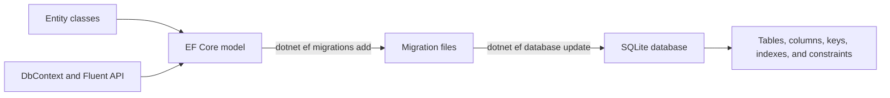
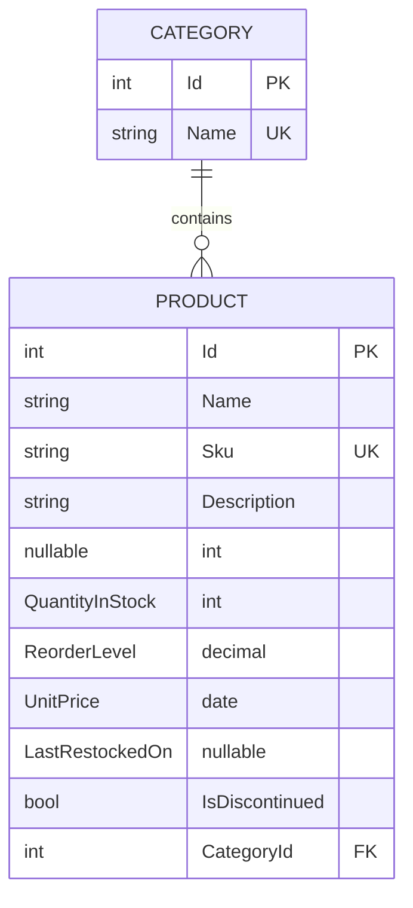

# EF Core Code First Database Setup and Migrations

This guide explains how an ASP.NET Core MVC application can define a database in C# and create or update the real database with Entity Framework Core migrations. It uses the `InventoryManager` project in this repository as the concrete example.

> Verified against .NET 9 and Entity Framework Core 9.0.19 in this repository. Commands and general concepts also apply to later EF Core versions, but package and tool versions should match the application's EF Core major version.

## Contents

1. [The mental model](#the-mental-model)
2. [The InventoryManager schema](#the-inventorymanager-schema)
3. [Packages and tools](#packages-and-tools)
4. [Define entity classes](#define-entity-classes)
5. [Create and configure DbContext](#create-and-configure-dbcontext)
6. [Configure the connection and dependency injection](#configure-the-connection-and-dependency-injection)
7. [Create the first migration and database](#create-the-first-migration-and-database)
8. [Understand generated migration files](#understand-generated-migration-files)
9. [Understand the Category-Product relationship](#understand-the-category-product-relationship)
10. [Change the schema later](#change-the-schema-later)
11. [Command reference](#command-reference)
12. [Remove or roll back a migration safely](#remove-or-roll-back-a-migration-safely)
13. [Reset a disposable development database](#reset-a-disposable-development-database)
14. [SQLite-specific behavior](#sqlite-specific-behavior)
15. [Move from SQLite to SQL Server](#move-from-sqlite-to-sql-server)
16. [Production migration guidance](#production-migration-guidance)
17. [Troubleshooting](#troubleshooting)
18. [Source-control checklist](#source-control-checklist)
19. [End-to-end checklist](#end-to-end-checklist)

## The mental model

"Code First" means that C# classes and EF Core configuration describe the intended database model. Migrations convert changes in that model into repeatable database schema operations.



The important distinction is:

- **Entity classes and `DbContext`** describe what the application currently expects.
- **A migration** records one step in the database's schema history.
- **The model snapshot** records the model as of the latest migration.
- **The physical database** contains the tables and data.
- **`__EFMigrationsHistory`** records which migrations have been applied to that database.

Changing a C# class alone does not update an existing database. The normal workflow is:

1. Change the entity or `OnModelCreating` configuration.
2. Generate a new migration.
3. Inspect the migration.
4. Apply it to the intended database.
5. Commit the model and migration source files.

## The InventoryManager schema

The current project contains one required one-to-many relationship:



- A `Category` can have zero or many products.
- Every `Product` must have exactly one category.
- `Product.CategoryId` is the foreign key.
- Category names and product SKUs have unique indexes.
- Deleting a category is restricted while products still reference it.

The initial migration creates these database objects:

| Object | Purpose |
|---|---|
| `Categories` | Stores category rows. |
| `Products` | Stores product rows. |
| `PK_Categories` | Primary key on `Categories.Id`. |
| `PK_Products` | Primary key on `Products.Id`. |
| `FK_Products_Categories_CategoryId` | Requires every `Products.CategoryId` to reference a real category. |
| `IX_Categories_Name` | Unique index that prevents duplicate category-name values according to the database collation. |
| `IX_Products_Sku` | Unique index that prevents duplicate SKU values according to the database collation. |
| `IX_Products_CategoryId` | Index used for relationship queries and foreign-key checks. |
| `__EFMigrationsHistory` | Records applied EF Core migrations. |

`IX_Products_CategoryId` is generated by EF Core's foreign-key indexing convention; the two unique indexes are configured explicitly in `OnModelCreating`.

There are no seed-data operations, SQL default constraints, check constraints, computed columns, or concurrency tokens in the current model. A newly migrated database therefore has empty `Categories` and `Products` tables. C# value types start as `0` or `false` when the application constructs a new object, but that is not the same thing as configuring a SQL default constraint.

## Packages and tools

### Runtime and design-time packages

`InventoryManager.csproj` currently uses:

```xml
<PackageReference Include="Microsoft.EntityFrameworkCore.Design" Version="9.0.19">
  <PrivateAssets>all</PrivateAssets>
  <IncludeAssets>runtime; build; native; contentfiles; analyzers; buildtransitive</IncludeAssets>
</PackageReference>
<PackageReference Include="Microsoft.EntityFrameworkCore.Sqlite" Version="9.0.19" />
<PackageReference Include="Microsoft.EntityFrameworkCore.Tools" Version="9.0.19">
  <PrivateAssets>all</PrivateAssets>
  <IncludeAssets>runtime; build; native; contentfiles; analyzers; buildtransitive</IncludeAssets>
</PackageReference>
```

Their roles are different:

- `Microsoft.EntityFrameworkCore.Sqlite` is the SQLite database provider used when the application runs.
- `Microsoft.EntityFrameworkCore.Design` supplies design-time services required by migration tooling.
- `Microsoft.EntityFrameworkCore.Tools` provides Visual Studio Package Manager Console commands.
- `dotnet-ef` is a separate .NET command-line tool that provides `dotnet ef ...` commands.

Keep the EF Core provider, Design package, Tools package, and `dotnet-ef` tool on the same **major version**. This project deliberately keeps all NuGet EF packages at `9.0.19`.

### Install packages with the Visual Studio GUI

The GUI route is:

1. Right-click the `InventoryManager` project in Solution Explorer.
2. Select **Manage NuGet Packages**.
3. Search for and install the three packages listed above.
4. Choose versions compatible with the project's EF Core major version.

### Install packages with the .NET CLI

From the repository root:

```powershell
dotnet add .\InventoryManager\InventoryManager.csproj package Microsoft.EntityFrameworkCore.Sqlite --version 9.0.19
dotnet add .\InventoryManager\InventoryManager.csproj package Microsoft.EntityFrameworkCore.Design --version 9.0.19
dotnet add .\InventoryManager\InventoryManager.csproj package Microsoft.EntityFrameworkCore.Tools --version 9.0.19
```

### Install or update `dotnet-ef`

If `dotnet ef --version` says the command cannot be found:

```powershell
dotnet tool install --global dotnet-ef --version 9.0.19
```

If it is already installed and needs updating:

```powershell
dotnet tool update --global dotnet-ef --version 9.0.19
```

Verify it:

```powershell
dotnet ef --version
```

Installing the `Microsoft.EntityFrameworkCore.Tools` NuGet package does **not** install the separate `dotnet-ef` global tool. The Tools package is enough for Visual Studio Package Manager Console commands; the global/local tool is needed for `dotnet ef` commands.

## Define entity classes

The entity classes are ordinary C# classes. EF Core uses conventions plus explicit configuration to build a database model from them.

### Category

```csharp
public class Category
{
    public int Id { get; set; }
    public string Name { get; set; } = string.Empty;
    public ICollection<Product> Products { get; set; } = new List<Product>();
}
```

### Product

```csharp
public class Product
{
    public int Id { get; set; }
    public string Name { get; set; } = string.Empty;
    public string Sku { get; set; } = string.Empty;
    public string? Description { get; set; }
    public int QuantityInStock { get; set; }
    public int ReorderLevel { get; set; }
    public decimal UnitPrice { get; set; }
    public DateOnly? LastRestockedOn { get; set; }
    public bool IsDiscontinued { get; set; }
    public int CategoryId { get; set; }
    public Category? Category { get; set; }
}
```

### What EF Core learns from these classes

- A property named `Id` is recognized as the primary key by convention.
- SQLite generates integer primary-key values when rows are inserted.
- `Category.Products` is a collection navigation from one category to its products.
- `Product.Category` is a reference navigation from a product to its category.
- `Product.CategoryId` is a non-nullable `int`, so the relationship is required.
- Nullable CLR properties such as `string? Description` and `DateOnly? LastRestockedOn` can map to nullable columns.

Navigation properties represent relationships between objects. Foreign-key properties represent those relationships in the database. They are related but not interchangeable:

```text
Product.CategoryId = 3       database identity of the relationship
Product.Category             related Category object, if it was loaded
Category.Products            related Product objects, if they were loaded
```

## Create and configure DbContext

`InventoryDbContext` is EF Core's unit for querying, tracking changes, and saving them. It also exposes the application's EF model.

```csharp
using InventoryManager.Models;
using Microsoft.EntityFrameworkCore;

namespace InventoryManager.Data
{
    public class InventoryDbContext : DbContext
    {
        public InventoryDbContext(DbContextOptions<InventoryDbContext> options)
            : base(options)
        {
        }

        public DbSet<Category> Categories => Set<Category>();
        public DbSet<Product> Products => Set<Product>();

        protected override void OnModelCreating(ModelBuilder modelBuilder)
        {
            base.OnModelCreating(modelBuilder);

            modelBuilder.Entity<Category>(entity =>
            {
                entity.HasKey(category => category.Id);

                entity.Property(category => category.Name)
                    .IsRequired()
                    .HasMaxLength(50);

                entity.HasIndex(category => category.Name)
                    .IsUnique();
            });

            modelBuilder.Entity<Product>(entity =>
            {
                entity.HasKey(product => product.Id);

                entity.Property(product => product.Name)
                    .IsRequired()
                    .HasMaxLength(100);

                entity.Property(product => product.Sku)
                    .IsRequired()
                    .HasMaxLength(30);

                entity.HasIndex(product => product.Sku)
                    .IsUnique();

                entity.Property(product => product.Description)
                    .HasMaxLength(500);

                entity.Property(product => product.UnitPrice)
                    .HasPrecision(18, 2);

                entity.HasOne(product => product.Category)
                    .WithMany(category => category.Products)
                    .HasForeignKey(product => product.CategoryId)
                    .IsRequired()
                    .OnDelete(DeleteBehavior.Restrict);
            });
        }
    }
}
```

### What `DbSet` means

```csharp
public DbSet<Product> Products => Set<Product>();
```

This gives the application a typed entry point for querying and changing product entities:

```csharp
var products = _context.Products.ToList();
_context.Products.Add(product);
_context.Products.Remove(product);
_context.SaveChanges();
```

A `DbSet` is not itself an in-memory list. Before materialization methods such as `ToList()`, a LINQ query usually represents SQL that EF Core will send to the configured database provider.

### What the Fluent API configuration does

| Configuration | Meaning |
|---|---|
| `HasKey(...)` | Configures the primary key. |
| `IsRequired()` | Configures a non-null database value or required relationship. |
| `HasMaxLength(50)` | Adds maximum-length metadata. Providers such as SQL Server use it when choosing a column type; SQLite's `TEXT` type does not itself enforce this limit. |
| `HasPrecision(18, 2)` | Describes 18 total decimal digits, with 2 after the decimal point. Provider behavior differs; SQLite does not have a native `decimal` type. |
| `HasIndex(...)` | Creates an index for lookup/performance or uniqueness. |
| `IsUnique()` | Prevents multiple rows from having the same indexed value according to database comparison/collation rules. |
| `OnDelete(DeleteBehavior.Restrict)` | Prevents deleting a parent category while products reference it. |

Fluent API configuration is database-model configuration. MVC input validation is separate. For example, SQLite may not enforce `HasMaxLength(100)` as a physical text-length limit, so the application still uses `[StringLength(100)]` on its input model.

## Configure the connection and dependency injection

### Connection string

`InventoryManager/appsettings.json` contains:

```json
{
  "ConnectionStrings": {
    "InventoryDatabase": "Data Source=inventory.db"
  }
}
```

For SQLite, `Data Source` is the database-file path. `inventory.db` is a relative path, and SQLite resolves relative paths from the process's current working directory. Visual Studio normally starts this project with the project directory as the working directory, which is why the file appears at `InventoryManager/inventory.db`.

Be careful when running commands from a different directory: a relative connection string can cause a second database file to be created somewhere unexpected. Confirm the target path before applying migrations.

### Register DbContext

`Program.cs` reads the connection and registers the context:

```csharp
using InventoryManager.Data;
using Microsoft.EntityFrameworkCore;

var builder = WebApplication.CreateBuilder(args);

builder.Services.AddControllersWithViews();

var connectionString =
    builder.Configuration.GetConnectionString("InventoryDatabase")
    ?? throw new InvalidOperationException(
        "Connection string 'InventoryDatabase' was not found");

builder.Services.AddDbContext<InventoryDbContext>(options =>
    options.UseSqlite(connectionString));
```

`AddDbContext` registers `InventoryDbContext` with dependency injection. In a normal ASP.NET Core application it is scoped: one context instance is created for one HTTP request and disposed when that request ends.

A controller can then receive it through its constructor:

```csharp
public ProductsController(InventoryDbContext dbContext)
{
    _context = dbContext;
}
```

The controller does not construct the context. ASP.NET Core's dependency-injection container sees the constructor requirement and supplies the configured scoped instance.

The current project does **not** call `EnsureCreated()`, `Database.Migrate()`, or any seed routine during application startup. Starting the website does not create or update its schema; the migration commands in this guide do that explicitly.

Do not mix `EnsureCreated()` with a migrations-based workflow. `EnsureCreated()` creates a schema directly and bypasses migration history, which makes later migration management unreliable. If automatic startup migration is ever considered, `Database.Migrate()` is the migrations-aware API, but production applications usually benefit from a separate, controlled migration deployment step.

## Create the first migration and database

> The initial migration already exists in this repository. Do not run `migrations add InitialInventorySchema` again unless you are following these steps in a new project. Running `database update` is safe when the correct database is already current; EF checks migration history and applies only pending migrations.

For a fresh clone of this existing repository, restore/install the appropriate tool and run only the database update step. The tracked migration files already describe how to create the schema.

### Recommended: run from the project directory

This avoids ambiguity around the relative SQLite file path:

```powershell
Set-Location .\InventoryManager
dotnet ef migrations add InitialInventorySchema --context InventoryDbContext
dotnet ef database update --context InventoryDbContext
```

The first command generates migration source files. The second creates `inventory.db` if necessary and applies the migration.

### Run from the repository root

Specify both the target project and startup project:

```powershell
dotnet ef migrations add InitialInventorySchema `
    --project .\InventoryManager\InventoryManager.csproj `
    --startup-project .\InventoryManager\InventoryManager.csproj `
    --context InventoryDbContext `
    --output-dir Migrations
```

Because this project uses a relative SQLite path, explicitly choose the database file when updating from the repository root:

```powershell
dotnet ef database update `
    --project .\InventoryManager\InventoryManager.csproj `
    --startup-project .\InventoryManager\InventoryManager.csproj `
    --context InventoryDbContext `
    --connection "Data Source=.\InventoryManager\inventory.db"
```

Definitions:

- The **target project** is where the `DbContext` and migration files live.
- The **startup project** is built and executed at design time so EF can read configuration and construct the context.
- They are the same project in `InventoryManager`, but larger solutions sometimes separate them.

### Visual Studio Package Manager Console

Open **Tools → NuGet Package Manager → Package Manager Console**.

The easiest GUI-assisted setup is:

1. Set the solution's startup project to `InventoryManager`.
2. Select `InventoryManager` in Package Manager Console's **Default project** dropdown.
3. Run:

```powershell
Add-Migration InitialInventorySchema
Update-Database
```

You can also name both projects explicitly:

```powershell
Add-Migration InitialInventorySchema -Project InventoryManager -StartupProject InventoryManager -Context InventoryDbContext -OutputDir Migrations
Update-Database -Project InventoryManager -StartupProject InventoryManager -Context InventoryDbContext
```

### What the commands do

`migrations add` / `Add-Migration`:

1. Builds the startup project.
2. Creates `InventoryDbContext` at design time.
3. Builds the current EF model from entities and configuration.
4. Compares it with `InventoryDbContextModelSnapshot`.
5. Generates schema operations and updates the snapshot.

`database update` / `Update-Database`:

1. Opens the configured database connection.
2. Creates the database when supported and it does not exist.
3. Reads `__EFMigrationsHistory`.
4. Runs `Up()` for each pending migration, in order.
5. Records each successfully applied migration in the history table.

## Understand generated migration files

The initial migration generated three important files:

```text
InventoryManager/Migrations/
├── 20260827024843_InitialInventorySchema.cs
├── 20260827024843_InitialInventorySchema.Designer.cs
└── InventoryDbContextModelSnapshot.cs
```

### Main migration

The main migration contains `Up()` and `Down()`:

```csharp
protected override void Up(MigrationBuilder migrationBuilder)
{
    migrationBuilder.CreateTable(...);
    migrationBuilder.CreateIndex(...);
}

protected override void Down(MigrationBuilder migrationBuilder)
{
    migrationBuilder.DropTable(...);
}
```

- `Up()` moves the schema forward.
- `Down()` describes how to reverse that migration.

The actual initial migration creates `Categories` before `Products` because the product table needs to reference the category table. Its `Down()` reverses that order and drops `Products` first so the foreign key is removed before `Categories`.

### Designer file

The timestamped `.Designer.cs` file contains generated metadata describing the EF model associated with that migration. It should normally remain generated and committed.

### Model snapshot

`InventoryDbContextModelSnapshot.cs` represents the model after the latest migration. When a new migration is created, EF compares the newly built model with this snapshot to determine the changes.

Do not hand-edit the snapshot to hide a model difference. Correct the model/configuration and generate or remove migrations through EF tooling.

### Migration history table

The model snapshot lives in source control. `__EFMigrationsHistory` lives inside each database. They solve different problems:

| Location | Question answered |
|---|---|
| Model snapshot | "What model did the latest source migration represent?" |
| `__EFMigrationsHistory` | "Which migrations have been applied to this database?" |

Two developers can have identical source code but different local database states. `database update` uses migration history to bring the selected database forward.

## Understand the Category-Product relationship

The relationship configuration is:

```csharp
entity.HasOne(product => product.Category)
    .WithMany(category => category.Products)
    .HasForeignKey(product => product.CategoryId)
    .IsRequired()
    .OnDelete(DeleteBehavior.Restrict);
```

Read it from the product's perspective:

1. `HasOne(product => product.Category)` — each product references one category.
2. `WithMany(category => category.Products)` — a category can be referenced by many products.
3. `HasForeignKey(product => product.CategoryId)` — `CategoryId` stores the relationship in `Products`.
4. `IsRequired()` — a product cannot exist without a category.
5. `Restrict` — the database must reject deletion of a referenced category rather than deleting its products automatically.

The migration turns this into a real foreign-key constraint:

```csharp
table.ForeignKey(
    name: "FK_Products_Categories_CategoryId",
    column: x => x.CategoryId,
    principalTable: "Categories",
    principalColumn: "Id",
    onDelete: ReferentialAction.Restrict);
```

This provides final database protection. Controller validation can show a friendly message before attempting a restricted delete, but it does not replace the foreign-key constraint. Another process or a race condition could change data after the controller's check; the database constraint remains the final authority.

## Change the schema later

Suppose a new optional storage-location field is needed for products.

### 1. Change the entity

```csharp
public string? StorageLocation { get; set; }
```

### 2. Configure it if needed

```csharp
entity.Property(product => product.StorageLocation)
    .HasMaxLength(50);
```

### 3. Build before generating the migration

From the project directory:

```powershell
dotnet build
```

Fix build errors first. Migration tooling builds the project and cannot reliably scaffold a model that does not compile.

### 4. Generate a new migration

```powershell
dotnet ef migrations add AddProductStorageLocation --context InventoryDbContext
```

Visual Studio Package Manager Console equivalent:

```powershell
Add-Migration AddProductStorageLocation
```

Use a descriptive migration name. Treat it like a short statement of the schema change, not a generic name such as `Update1`.

### 5. Inspect the generated code

Confirm that the migration changes only what was intended. For this example, expect an `AddColumn` operation for `Products.StorageLocation` and a corresponding `DropColumn` in `Down()`.

Pay special attention to warnings or generated operations that can lose data, such as dropping a column, narrowing a type, or making an existing nullable column required.

### 6. Apply it locally

```powershell
dotnet ef database update --context InventoryDbContext
```

PMC:

```powershell
Update-Database
```

### 7. Test the application

Test both:

- Existing rows created before the migration.
- New rows created after the migration.

### 8. Commit the complete schema change

Commit together:

- Entity changes.
- `DbContext` configuration changes.
- New main migration.
- New migration Designer file.
- Updated model snapshot.
- Related application changes.

Do not commit the local `inventory.db` file.

## Command reference

The commands below assume the current directory is `InventoryManager`. Add `--project`, `--startup-project`, `-Project`, and `-StartupProject` when running in a multi-project context.

| Purpose | .NET CLI | Visual Studio PMC |
|---|---|---|
| Show tool version | `dotnet ef --version` | `Get-Help about_EntityFrameworkCore` |
| Show context information | `dotnet ef dbcontext info` | `Get-DbContext` |
| List contexts | `dotnet ef dbcontext list` | `Get-DbContext` |
| Add migration | `dotnet ef migrations add AddProductLocation` | `Add-Migration AddProductLocation` |
| List migrations | `dotnet ef migrations list` | `Get-Migration` |
| Check uncaptured model changes | `dotnet ef migrations has-pending-model-changes` | `Get-Migration` does not perform the same check; generate/inspect a migration or use CLI. |
| Apply all pending migrations | `dotnet ef database update` | `Update-Database` |
| Update to named migration | `dotnet ef database update InitialInventorySchema` | `Update-Database InitialInventorySchema` |
| Roll back all migrations | `dotnet ef database update 0` | `Update-Database 0` |
| Remove latest migration | `dotnet ef migrations remove` | `Remove-Migration` |
| Generate SQL from 0 to latest | `dotnet ef migrations script --output inventory-migrations.sql` | `Script-Migration -Output inventory-migrations.sql` |
| Generate SQL for a range | `dotnet ef migrations script FromMigration ToMigration` | `Script-Migration FromMigration ToMigration` |

> `database update 0`, `Update-Database 0`, and database-drop commands can remove the entire schema and all data. Use them only against a verified disposable development database.

### Specify a context

If a project later contains multiple contexts:

```powershell
dotnet ef migrations add AddProductLocation --context InventoryDbContext
dotnet ef database update --context InventoryDbContext
```

PMC:

```powershell
Add-Migration AddProductLocation -Context InventoryDbContext
Update-Database -Context InventoryDbContext
```

### Generate a SQL script for review

```powershell
dotnet ef migrations script `
    --output .\inventory-migrations.sql
```

For SQL Server and other providers that support it, `--idempotent` can generate a script that checks migration history before applying each migration. SQLite cannot generate idempotent migration scripts because it lacks the procedural `if/then` support needed by EF's script generator. For SQLite, generate a script from a known current migration or use `database update` against the verified database.

## Remove or roll back a migration safely

There are three materially different situations.

### Latest migration was generated but never applied anywhere

Remove it through EF tooling:

```powershell
dotnet ef migrations remove
```

PMC:

```powershell
Remove-Migration
```

Then correct the model and generate the migration again.

### Latest migration was applied only to a disposable local database

First move the database back to the previous migration, then remove the source migration:

```powershell
dotnet ef database update PreviousMigrationName
dotnet ef migrations remove
```

PMC:

```powershell
Update-Database PreviousMigrationName
Remove-Migration
```

Back up any data that matters before rolling back. A migration's `Down()` method can drop columns or tables.

### Migration was applied to a shared, test, staging, or production database

Do **not** delete or rewrite that historical migration. Keep it and create a new corrective migration.

Why:

- Other databases may already record the old migration in `__EFMigrationsHistory`.
- Later migrations and the snapshot may depend on that history.
- Rewriting it does not automatically rewrite databases where it was already applied.
- Source history would no longer describe what actually happened.

This is why editing an old applied migration can create the kind of confusing schema mismatch that produces "no such column" or "table already exists" errors.

## Reset a disposable development database

Sometimes the migration source is correct and only the local test data needs to be discarded.

Safe development reset:

1. Confirm the exact database is disposable.
2. Stop the application and any database browser so SQLite releases the files.
3. If anything matters, copy `InventoryManager/inventory.db` to a backup location.
4. Delete only these verified local files in Visual Studio Folder View or File Explorer:
   - `InventoryManager/inventory.db`
   - `InventoryManager/inventory.db-shm`
   - `InventoryManager/inventory.db-wal`
5. Keep the `Migrations` folder.
6. From the `InventoryManager` directory, run:

```powershell
dotnet ef database update
```

Or use Package Manager Console:

```powershell
Update-Database
```

EF recreates a clean database by applying every migration in order.

Deleting the migration files is **not** part of a normal database reset. Resetting migration history is a separate, higher-risk operation that should be limited to early solo development where no shared database depends on that history.

## SQLite-specific behavior

SQLite is excellent for learning, local tools, tests, and small applications, but it is not a smaller version of SQL Server.

### Storage types in this migration

The generated migration maps values as follows:

| C# property | SQLite column type in this migration |
|---|---|
| `int` | `INTEGER` |
| `string` | `TEXT` |
| `bool` | `INTEGER` |
| `DateOnly` | `TEXT` |
| `decimal` | `TEXT` |

The `type`, `precision`, `scale`, and `maxLength` information in the migration still describes the EF model, but SQLite's flexible type system does not enforce every rule in the same way SQL Server would.

Practical consequences:

- Keep MVC/server validation for string lengths and numeric ranges.
- Keep unique indexes and foreign keys as final database protections.
- SQLite can read, write, and test equality for `decimal`, but it does not natively support decimal comparison and ordering. Such queries may require deliberate client-side evaluation after materialization or a configured value conversion; test the chosen behavior rather than assuming SQL Server semantics.
- Case sensitivity depends on collation. A unique index and an application-level case-insensitive duplicate check can enforce different rules unless collation is configured deliberately.

### Relative file paths

`Data Source=inventory.db` means "open or create `inventory.db` relative to the current working directory." If two commands run from different working directories, they can operate on different databases even when the connection-string text is identical.

When debugging an unexpected empty or outdated database:

1. Stop the app.
2. Search the solution for every `inventory.db` file.
3. Compare modification times and sizes.
4. Verify the command's working directory and connection string.
5. Apply migrations only after identifying the intended file.

### WAL and SHM files

SQLite can create:

- `inventory.db-wal` — write-ahead log.
- `inventory.db-shm` — shared-memory file used with the WAL.

They are runtime database files, not source code. Stop every process using the database before copying or deleting a development database. This repository ignores all three InventoryManager database files.

### Migration limitations

SQLite cannot perform every schema alteration directly. EF Core can rebuild a table for many operations by creating a replacement table, copying data, dropping the old table, and renaming the replacement. This makes migration review and backups especially important for schema changes that alter or drop columns.

## Move from SQLite to SQL Server

The domain model, LINQ fundamentals, `DbContext`, and relationship intent remain broadly the same. The provider, connection string, generated SQL, and migration details change.

### 1. Install the SQL Server provider

```powershell
dotnet add package Microsoft.EntityFrameworkCore.SqlServer --version 9.0.19
```

Or use Visual Studio's NuGet Package Manager GUI.

### 2. Change the connection string

Example for LocalDB development:

```json
{
  "ConnectionStrings": {
    "InventoryDatabase": "Server=(localdb)\\mssqllocaldb;Database=InventoryManager;Trusted_Connection=True;TrustServerCertificate=True"
  }
}
```

Do not commit real production usernames, passwords, or tokens. Use environment variables, deployment secrets, or ASP.NET Core user secrets for development credentials.

### 3. Change provider registration

```csharp
builder.Services.AddDbContext<InventoryDbContext>(options =>
    options.UseSqlServer(connectionString));
```

### 4. Treat migrations as provider-specific artifacts

Migrations generated for SQLite contain SQLite-specific column types and operations. Do not assume those files are an appropriate production migration set for SQL Server.

Common approaches are:

- Use SQL Server from the beginning for environments that must closely match production.
- Maintain separate provider-specific migration sets.
- When changing providers early in an undeployed learning project, create a fresh migration set for the new provider and a new development database.

For a deployed application, switching providers is a data-migration project, not merely a `UseSqlite` to `UseSqlServer` text replacement. Plan schema conversion, data transfer, validation, downtime, backups, and rollback.

SQL Server will also differ in useful ways:

- `HasMaxLength(100)` contributes to a bounded string type such as `nvarchar(100)`.
- `HasPrecision(18, 2)` maps naturally to a fixed-precision decimal column.
- `DeleteBehavior.Restrict` is typically represented by SQL Server as `NO ACTION`, because SQL Server does not support the `RESTRICT` keyword. Both prevent the database from cascading the category deletion.

## Production migration guidance

`dotnet ef database update` is convenient for local development. Production deployment needs tighter control.

Safer production choices include:

- Generate SQL scripts, review them, back up the database, and have the deployment process or DBA apply them.
- Generate an EF Core migration bundle for a controlled deployment artifact.
- Apply migrations as a dedicated deployment step with appropriate database permissions.

Avoid assuming that an application should automatically migrate its production database whenever it starts. Multiple application instances can start at once, migrations may require elevated permissions, and a destructive or long-running migration may need coordinated downtime.

For every important environment:

1. Know the currently applied migration.
2. Back up the database.
3. Review the forward migration or SQL script.
4. Identify data-loss and lock/downtime risks.
5. Test against a production-like copy.
6. Define rollback or restore steps.
7. Apply once through a controlled process.
8. Verify schema and application behavior.

## Troubleshooting

### `dotnet ef` command not found

Install the global tool:

```powershell
dotnet tool install --global dotnet-ef --version 9.0.19
```

Then open a new terminal if the executable is still not found on `PATH`.

### Build failed while creating a migration

Run:

```powershell
dotnet build
```

Fix compilation errors first. EF's design-time tools must build and load the startup project.

### Unable to create `InventoryDbContext`

Check:

- `InventoryManager` is the startup project.
- The target/startup project options point to the right `.csproj`.
- `Program.cs` registers `InventoryDbContext`.
- The connection string exists.
- Provider packages and `using Microsoft.EntityFrameworkCore;` are present.
- The context constructor accepts `DbContextOptions<InventoryDbContext>` and passes it to `base(options)`.

Useful command:

```powershell
dotnet ef dbcontext info --context InventoryDbContext
```

### `SQLite Error 1: no such column ...`

Usually the C# model expects a column that the selected database does not yet have.

Check:

```powershell
dotnet ef migrations list
dotnet ef database update
```

Also verify that the application and migration command point to the same `inventory.db` file. Do not solve the mismatch by editing an old applied migration.

### `table ... already exists`

Possible causes:

- Tables were created manually but migration history does not record them.
- The command targeted the wrong database.
- Migration files/history were deleted or rewritten independently.
- A copied database and current migration source no longer match.

Inspect the database and `__EFMigrationsHistory` before deleting anything. For a disposable local database, the verified reset procedure may be simplest. For a shared database, create a planned corrective migration or repair its migration state with appropriate review.

### Migration contains no operations

Possible explanations:

- The model did not actually change.
- The change affects application validation but not the EF database model.
- The model snapshot already contains the change.
- The wrong `DbContext` or project was selected.

Use:

```powershell
dotnet ef migrations has-pending-model-changes
```

### Changes are in the migration but not the database

Creating a migration does not apply it. Run `database update` against the intended database and confirm it appears in migration history.

### Unexpected second SQLite database

Search for `inventory.db` across the repository and inspect the connection path. Relative paths are resolved from the working directory, so a root-terminal command and a Visual Studio run can create different files.

### Database is locked

Stop:

- The running web application.
- Debug sessions.
- SQLite database browsers.
- Other commands using the file.

Then retry. Do not delete `-wal` or `-shm` files while a process still owns the database.

EF Core 9 also uses a SQLite `__EFMigrationsLock` table to prevent two migration operations from changing the schema concurrently. If a migration process is killed, an abandoned lock can make a later migration wait indefinitely. First confirm that no migration is still running and back up the database. Only then follow Microsoft's SQLite-provider guidance for clearing an abandoned migration lock; do not treat deleting the lock table as a routine first response.

### Unique constraint failure despite controller validation

Application checks provide friendly feedback, but they are not atomic with `SaveChanges()`. Another request can insert the same value between the check and the write. Keep the unique database index as final protection and handle expected database exceptions where the application requires a friendly concurrent-write response.

### Category deletion fails

This is expected when products reference the category because the relationship uses `DeleteBehavior.Restrict`. Delete or move the dependent products first, or deliberately redesign the relationship behavior. Do not remove the constraint merely to hide the error.

### Package or tool version mismatch

Check:

```powershell
dotnet list package
dotnet ef --version
```

Keep EF Core components on a compatible major version. In this project the provider, Design package, and Tools package are all `9.0.19`.

## Source-control checklist

Commit:

- Entity classes.
- `DbContext` and Fluent API configuration.
- `Program.cs` provider registration.
- Safe configuration files without secrets.
- Main migration files.
- Migration Designer files.
- Model snapshot.
- Documentation describing non-obvious migration requirements.

Do not commit:

- `InventoryManager/inventory.db`
- `InventoryManager/inventory.db-shm`
- `InventoryManager/inventory.db-wal`
- Real database passwords or production connection secrets.
- `bin`, `obj`, or Visual Studio user files.

The repository's `.gitignore` already excludes the three InventoryManager SQLite files.

Those ignore entries are path-specific. An accidental `inventory.db` created at the repository root is **not** covered by them, which is another reason to verify the working directory and Git Changes before committing.

Before committing a schema change:

```powershell
dotnet build .\InventoryManager\InventoryManager.csproj
git status --short
git diff --check
```

Review migration code in Git Changes just as carefully as handwritten code. A generated migration is executable schema history, not disposable build output.

## End-to-end checklist

### New project

- [ ] Install a provider package.
- [ ] Install `Microsoft.EntityFrameworkCore.Design`.
- [ ] Install PMC Tools or `dotnet-ef`.
- [ ] Create entity classes.
- [ ] Create `DbContext` and `DbSet` properties.
- [ ] Configure keys, columns, indexes, and relationships.
- [ ] Add the connection string.
- [ ] Register the context with `AddDbContext` and the provider method.
- [ ] Build successfully.
- [ ] Generate the initial migration.
- [ ] Inspect `Up()`, `Down()`, and the snapshot.
- [ ] Apply the migration to the verified development database.
- [ ] Test database operations and relationship rules.
- [ ] Commit source and migration files, not the live database.

### Later schema change

- [ ] Change the entity and/or Fluent API.
- [ ] Build successfully.
- [ ] Generate a descriptively named new migration.
- [ ] Inspect for unintended or destructive operations.
- [ ] Generate/review SQL when appropriate.
- [ ] Back up data when the migration can affect it.
- [ ] Apply locally to the intended database.
- [ ] Test old and new data paths.
- [ ] Commit all model and migration changes together.
- [ ] Apply through a controlled deployment process in shared environments.

## Official references

- [EF Core migrations overview](https://learn.microsoft.com/en-us/ef/core/managing-schemas/migrations/)
- [Managing migrations](https://learn.microsoft.com/en-us/ef/core/managing-schemas/migrations/managing)
- [Applying migrations](https://learn.microsoft.com/en-us/ef/core/managing-schemas/migrations/applying)
- [.NET CLI EF Core tools reference](https://learn.microsoft.com/en-us/ef/core/cli/dotnet)
- [Visual Studio Package Manager Console EF Core tools](https://learn.microsoft.com/en-us/ef/core/cli/powershell)
- [Installing EF Core and its tools](https://learn.microsoft.com/en-us/ef/core/get-started/overview/install)
- [EF Core one-to-many relationships](https://learn.microsoft.com/en-us/ef/core/modeling/relationships/one-to-many)
- [EF Core indexes](https://learn.microsoft.com/en-us/ef/core/modeling/indexes)
- [SQLite provider limitations](https://learn.microsoft.com/en-us/ef/core/providers/sqlite/limitations)
- [Microsoft.Data.Sqlite connection strings](https://learn.microsoft.com/en-us/dotnet/standard/data/sqlite/connection-strings)
- [EF Core database providers](https://learn.microsoft.com/en-us/ef/core/providers/)
- [DbContext lifetime and configuration](https://learn.microsoft.com/en-us/ef/core/dbcontext-configuration/)
